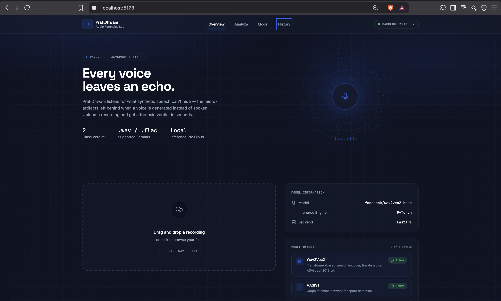
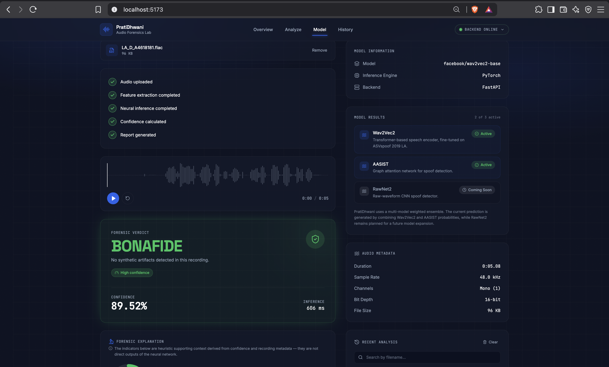
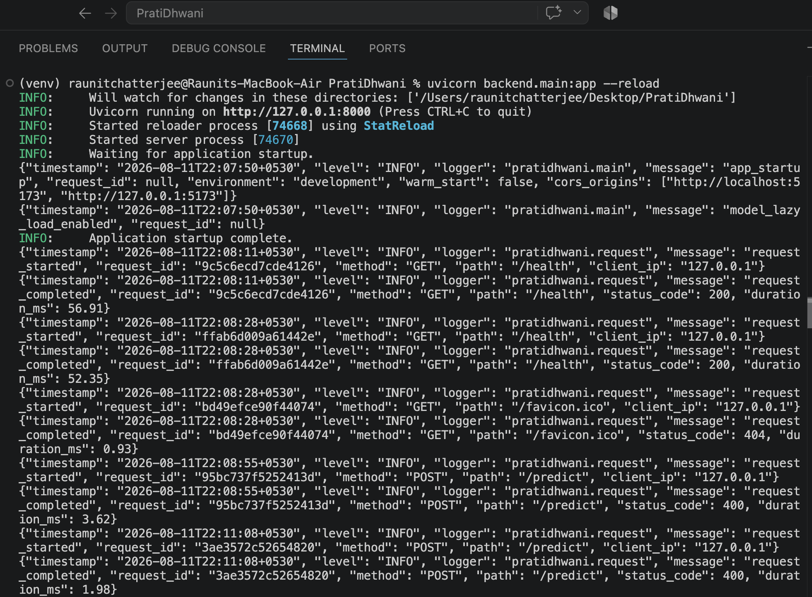
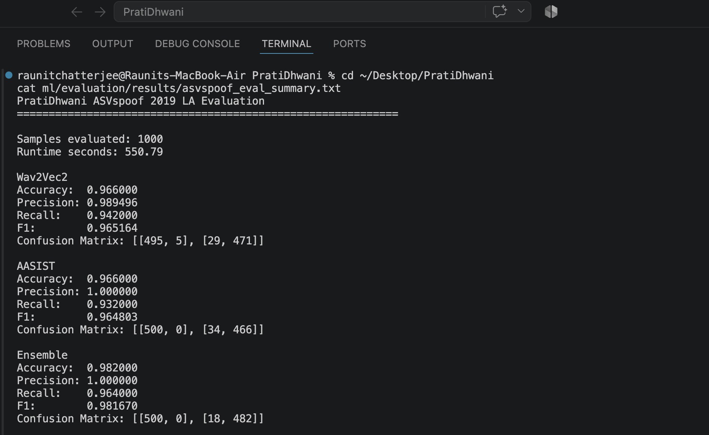

# PratiDhwani

**An end-to-end defensive cybersecurity system for voice deepfake and audio spoof detection.**

PratiDhwani fuses two independent anti-spoofing models — Wav2Vec2 and AASIST — through probability-level ensemble fusion, and exposes the resulting detector through a FastAPI backend with security-hardened middleware and a React dashboard. It is a defensive research project motivated by the growing use of voice cloning and synthetic speech in social-engineering fraud.

<p align="center">
  
  <br/>
  <sub>Dashboard overview — upload, model status, and forensic verdict in one view.</sub>
</p>

<p align="center">
  
  
  
  
</p>

---

## Table of Contents

- [Problem](#problem)
- [Architecture](#architecture)
- [Security Engineering](#security-engineering)
- [Evaluation Methodology](#evaluation-methodology)
- [Results](#results)
- [Tech Stack](#tech-stack)
- [Project Structure](#project-structure)
- [Setup](#setup)
- [API](#api)
- [Testing](#testing)
- [Limitations](#limitations)
- [Roadmap](#roadmap)
- [Ethical & Legal Notes](#ethical--legal-notes)
- [Author](#author)

---

## Problem

Most publicly available anti-spoofing datasets and detectors (ASVspoof, WaveFake, In-the-Wild) are built and evaluated almost entirely on monolingual English speech. PratiDhwani starts from that same acoustic detection foundation — a fused, well-evaluated Wav2Vec2 + AASIST ensemble — and is designed to grow toward the Hindi-English code-switched threat model relevant to Indian voice-cloning fraud (see [Roadmap](#roadmap)). That extension has not been built yet; the system described below is what's implemented and evaluated today.

The project is built around three principles:

1. **A single model isn't enough.** Wav2Vec2 contributes a self-supervised, transformer-based spectral representation; AASIST contributes a graph-attention architecture purpose-built for anti-spoofing. Fusing their output probabilities closes gaps that neither model covers alone.
2. **A detector is only useful if it's deployable.** PratiDhwani isn't a notebook — it's a FastAPI service with file validation, rate limiting, structured logging, and a 51-test backend suite, all wrapped around a stable core inference pipeline.
3. **Honest evaluation beats impressive-sounding claims.** Every number below is reported with the exact evaluation set it came from.

## Architecture

```
                    ┌─────────────────────┐
   Audio Upload ──▶ │   FastAPI Backend     │
                    │  (validation, rate    │
                    │   limiting, logging)  │
                    └──────────┬───────────┘
                               │
                    ┌──────────▼───────────┐
                    │  Inference Pipeline    │
                    │  (ml/inference/        │
                    │   predictor.py)        │
                    └──────────┬───────────┘
                               │
              ┌────────────────┴────────────────┐
              ▼                                  ▼
     ┌─────────────────┐              ┌─────────────────┐
     │    Wav2Vec2       │              │      AASIST       │
     │  spoof classifier │              │  spoof classifier │
     │     (active)       │              │     (active)       │
     └────────┬──────────┘              └────────┬──────────┘
              │        probability-level          │
              │      fusion (0.5 / 0.5 weights)   │
              └───────────────┬────────────────────┘
                               ▼
                    ┌─────────────────────┐
                    │ prediction + confidence│
                    │  → React Dashboard     │
                    └─────────────────────┘
```

The production ensemble fuses **Wav2Vec2** and **AASIST** at the probability level with equal weighting (0.5 / 0.5). A third architecture, **RawNet2**, is registered in the model layer and reports itself as unimplemented rather than fabricating a result if invoked — it is not part of the active ensemble.

<p align="center">
  
  <br/>
  <sub>Per-model status and fused verdict — Wav2Vec2 and AASIST active, RawNet2 marked as not yet implemented.</sub>
</p>

## Security Engineering

Verified backend security and reliability features:

- **File extension allowlist** — only `.wav` and `.flac` uploads are accepted.
- **Magic-byte validation** — the first chunk of every upload is checked against its actual binary signature before the rest of the file is streamed in, rejecting mismatched content early.
- **Upload size limit**, enforced while streaming rather than after buffering the full file.
- **Secure temporary file handling** with cleanup after inference.
- **Rate limiting** on inference endpoints.
- **Request IDs / correlation IDs** attached to every request for traceability across logs.
- **Structured JSON logging** throughout the request and inference lifecycle.
- **Security response headers** — `X-Content-Type-Options`, `X-Frame-Options`, `Referrer-Policy`, `Permissions-Policy`, plus `Strict-Transport-Security` in production.
- **Graceful error handling** — a catch-all exception handler logs the full traceback server-side (with request ID) but returns a generic message to the client, never leaking internals.
- **Model degradation handling** — the health endpoint reports per-model status (Wav2Vec2, AASIST, RawNet2) rather than a single opaque up/down flag.
- **Lazy model loading** by default — models load on first use rather than blocking startup.
- **Health endpoint** (`/health`) for service monitoring.
- **Stable core inference pipeline** — the ensemble logic, API layer, security middleware, and dashboard were all built around the existing `ml/inference/predictor.py` inference pipeline without changing its inference logic.

<p align="center">
  
  <br/>
  <sub>Structured JSON logs with request-ID correlation across the request lifecycle.</sub>
</p>

## Evaluation Methodology

- **Dataset:** ASVspoof 2019 LA evaluation partition, **balanced 1,000-sample subset** (bona fide vs. spoofed) — not the full evaluation partition. See `ml/evaluation/`.
- **Protocol:** Wav2Vec2 and AASIST evaluated independently, then combined via probability-level ensemble fusion (0.5 / 0.5 weighting); all three sets of metrics computed on the same held-out sample for a fair comparison.
- **Reporting standard:** results are quoted as *"98.2% accuracy on a balanced 1,000-sample evaluation drawn from the ASVspoof 2019 LA evaluation set"* — not as an unqualified headline number — since that's the claim the evidence actually supports.

## Results

| Model | Accuracy | Precision | Recall | F1 |
|---|---|---|---|---|
| Wav2Vec2 (solo) | 96.60% | 98.95% | 94.20% | 96.52% |
| AASIST (solo) | 96.60% | 100.00% | 93.20% | 96.48% |
| **Ensemble (fused)** | **98.20%** | **100.00%** | **96.40%** | **98.17%** |

**Ensemble confusion matrix** (500 bona fide, 500 spoofed):

|  | Predicted Bonafide | Predicted Spoof |
|---|---|---|
| **Actual Bonafide** | 500 | 0 |
| **Actual Spoof** | 18 | 482 |

On this evaluation subset, the ensemble produced **0 false positives and 18 false negatives**.

**How to read this:** the ensemble's 100% precision means every clip it flagged as spoofed actually was. The 18 false negatives are spoofed clips that passed as bona fide — a real gap, stated plainly rather than rounded away. Fusing the two solo models improved recall over either one individually (94.20% and 93.20% respectively) while holding precision at 100%, which is the core evidence for the ensemble approach over either single model. These figures describe performance on this specific 1,000-sample subset, not full-dataset or real-world performance.

<p align="center">
  
  <br/>
  <sub>Evaluation run output for all three models on the balanced 1,000-sample ASVspoof 2019 LA subset.</sub>
</p>

## Tech Stack

**ML / Inference**
`Python` · `PyTorch` · `torchaudio` · `transformers` (Wav2Vec2) · `AASIST` · `librosa` · `scikit-learn`

**Backend**
`FastAPI` · `Uvicorn` · custom security & rate-limiting middleware · `pytest`

**Frontend**
`React` · `Vite`

## Project Structure

```
PratiDhwani/
├── backend/
│   ├── main.py           # FastAPI app, middleware wiring, /health, /
│   ├── api/               # /predict route
│   ├── core/               # config, logging, request context, upload validation
│   ├── middleware/         # rate limiting, security headers, request context
│   ├── models/             # BaseModel, Wav2Vec2Model, AasistModel, RawNet2Model
│   ├── schemas/             # response models
│   ├── services/             # prediction & ensemble fusion services
│   ├── websocket/
│   └── tests/               # pytest suite (51 tests)
├── config/
├── docs/
│   └── screenshots/
├── frontend/                 # React + Vite dashboard
├── ml/
│   ├── inference/
│   │   └── predictor.py       # Core inference pipeline
│   ├── preprocessing/
│   ├── training/
│   ├── evaluation/             # ASVspoof evaluation scripts & results
│   ├── models/
│   ├── metadata/
│   └── checkpoints/
├── scripts/
├── tests/
├── requirements.txt
└── README.md
```

## Setup

**Backend**

```bash
git clone https://github.com/RaunitChatterjee/PratiDhwani.git
cd PratiDhwani
python -m venv venv && source venv/bin/activate
pip install -r requirements.txt
uvicorn backend.main:app --reload
```

**Frontend** (separate terminal)

```bash
cd frontend
npm install
npm run dev
```

Production frontend build:

```bash
npm run build
```

## API

```bash
curl -X POST "http://localhost:8000/predict" \
  -F "file=@sample.wav"
```

```json
{
  "prediction": "bonafide",
  "confidence": 59.27,
  "bonafide": 59.27,
  "spoof": 40.73
}
```

`confidence`, `bonafide`, and `spoof` are percentages.

## Testing

```bash
pytest backend/tests -v
```

51 tests passing, 1 warning, as of the latest verified run — covering the API, security middleware, ensemble fusion, and prediction service. Frontend test coverage is not yet in place; `npm run build` is verified manually rather than through an automated pipeline (see Roadmap).

## Limitations

- Evaluation to date is on ASVspoof 2019 LA, which is predominantly English-language. Performance on Hindi-English code-switched, real-time-converted audio has not yet been separately measured.
- The 1,000-sample balanced evaluation set is a subset of the full ASVspoof LA eval partition, not the whole thing; results should be read as indicative rather than exhaustive.
- RawNet2 is registered in the model layer but not implemented; it is not part of the current ensemble.
- The conversational risk-scoring layer (transcription-based urgency/authority-impersonation detection), challenge-response liveness testing, and MITRE ATLAS technique mapping are not yet implemented — see Roadmap.
- No authentication layer currently exists on the API.
- No containerization (Docker) or CI pipeline is currently configured — see Roadmap.
- Voice conversion artifacts from the specific tools actual fraud rings use are unknown and evolve continuously; no static detector is a permanent solution.

## Roadmap

- [ ] Implement RawNet2 and evaluate its contribution to the ensemble.
- [ ] Fine-tune and evaluate on a purpose-built Hindi-English code-switched, RVC-converted dataset to close the gap between benchmark performance and the real-world threat model.
- [ ] Conversational risk scoring layer (Whisper transcription + urgency/authority-impersonation classifier) fused with the acoustic risk score.
- [ ] Challenge-response liveness testing as an active defense layer.
- [ ] Map detection alerts to MITRE ATLAS techniques in the dashboard.
- [ ] Frontend test coverage.
- [ ] API authentication.
- [ ] Dockerize the stack and add a CI pipeline (backend tests, frontend build).

## Ethical & Legal Notes

PratiDhwani is a **defensive research project**. No real individuals' voices are used without consent anywhere in this system's training, evaluation, or demo data — all audio is drawn from open corpora or self-recorded material. This repository does not, and will not, include anything that could be repurposed to generate fraudulent audio.

## Author

Built by [Raunit Chatterjee](https://github.com/RaunitChatterjee) — B.Tech Computer Science & Engineering (Cyber Security), Manipal University Jaipur.

Part of a broader portfolio of AI-and-security projects, including CloudSentinel AI and TrustAuth.